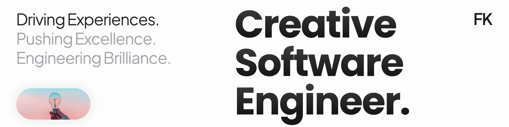

# 👨🏽‍💻 Developer and Creative Thinker 💡
- 🔭 I’m currently working on a uni automotive project 
- 🌱 I’m currently learning everything about ML and Python
- ⚡ Interests: Football ⚽, Stocks 📈, Cars 🏎

## 💻 Tech Stack:
                                   

## ✍️ Random Dev Quote

