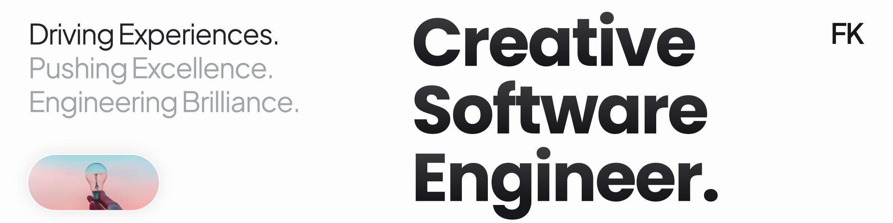

<!---->

# 👨🏽‍💻 Software Engineer
_*I like to do hard things to learn new stuff*_
- 🔭 I’m currently researching to work on a latent 3D representation for autonomous driving
- 🌱 I’m currently learning more about high-performance features of C++
- 💪 Project I'm most proud of (until my next one): [Neural Navi](https://github.com/floriankulig/neural-navi), a driver assistance system aiming to make driving safer and more economic using multimodal deep learning
- ⚡ Interests: Football ⚽, Finance 📈, Cars 🏎

## 💻 Things I mostly use:
                          

## ✍️ Random Dev Quote

